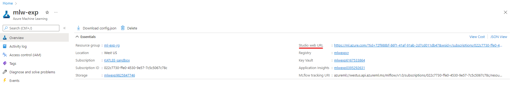
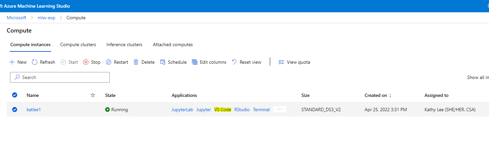
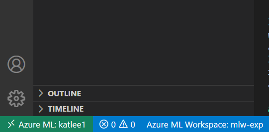

# Scenario : Customer Segmentation

The scenario we have chosen for this tutorial exercise is the following:

An online retailer would like to gain insights through its customers buying behaviours. Given a record of customers online transactions, we perform Customer Value Analysis, described by [Recency, Frequency, Monetary value](https://clevertap.com/blog/rfm-analysis/). These characteristics are then used to segment the customers into clusters via machine learning techniques, in this case, k-means clustering. 

This is a common use case where businesses want to gain some insight into their clientele, understand different groups of customers they are dealing with, so that businesses can customise the services or campaigns to target individual groups to serve them more effectively.

Note that this example makes use of [Azure Machine Learning](https://docs.microsoft.com/en-gb/azure/machine-learning/) with [Github Actions](https://docs.github.com/en/actions). 

## Data
[Online Retail Data](https://archive.ics.uci.edu/ml/datasets/online+retail) | This is a transnational data set which contains all the transactions occurring between 01/12/2010 and 09/12/2011 for a UK-based and registered non-store online retail.The company mainly sells unique all-occasion gifts. Many customers of the company are wholesalers.

# Getting started with AI development and MLOps

## Create azure resources 

For this learning experience, you will need to create resources in Azure. 

Please follow this documentation to set up an Azure Machine Learning (AML) workspace:
https://docs.microsoft.com/en-us/azure/machine-learning/quickstart-create-resources

When creating an AML workspace, the wizard will guide you through creating dependent resources like:
- storage account
- key vault
- application insights
- container registry

Make sure "create new" container registry when moving through the wizard.

Once your workspace is ready, go to your Azure Machine Learning workspace in the Azure Portal, and launch the studio.



In the left navigation, click "Compute" and click the "+ New" button to create a compute instance for yourself to use.

Once your compute is ready, select the VS Code link



## Create conda environment on your compute instance

VSCode will open - make sure you see your compute and workspace in the task bar and that you have the proper extensions installed (see prerequisites.) Sign in to Azure in VS code if prompted to do so.



Clone this [repository](https://github.com/csu-devsquad-latam/aidev-mlops).

Open your terminal window and run this command:

```
sudo chmod -R 777 /anaconda/pkgs
```

Change directories to `.aml/environments/`, you will find the conda environment file named, `conda_dependencies.yml`. 

In this directory, run this commands, giving a name, `py38_cluster_dev`, to this environment:

```
conda env create ---name py38_cluser_dev --file conda_dependencies.yml
```

This repo is tested with `conda==4.13.0`. If `conda` notifies to do an update, consider updating `conda`. Within that message, it will give command such as

```
conda update -n base -c defaults conda
``` 

Once the installation is complete, run the following command to check that the newly created environment exists.

```
conda env list
```

If it exists, you will see the newly created environment named, `py38_cluster_dev`, listed.

To activate the environment, 

```
conda activate py38_cluster_dev
```

Note that this procedure can also be done on the terminal within the AML studio.

Note also that you may have to close and re-open your VSCode session in order for your new conda environment to appear as a selectable Kernel in Jupyter Notebooks.

## Notebooks

To access Notebooks in VSCode, open VSCode. 

In VS code, open [00-explore-and-prepare-data.ipynb](https://github.com/csu-devsquad-latam/aidev/blob/main/notebooks/00-data/00-explore-and-prepare-data.ipynb). In the upper right of VS Code, click on "Select Kernel" and choose the environment you just created in the previous step (`py38_cluster_dev`). 

The series of [notebooks](https://github.com/csu-devsquad-latam/aidev/tree/main/notebooks) bring you from raw data to model creation. 

## MLOps
Code related to MLOps using Github Action can be found [here](https://github.com/csu-devsquad-latam/aidev/tree/main/src)

# Disclaimer
This publication is provided as is without any express or implied warranties. While every effort has been taken to ensure the accuracy of the information contained in this publication, the authors/maintainers/contributors assume no responsibility for errors or omissions, or for damages resulting from the use of the information contained herein.
