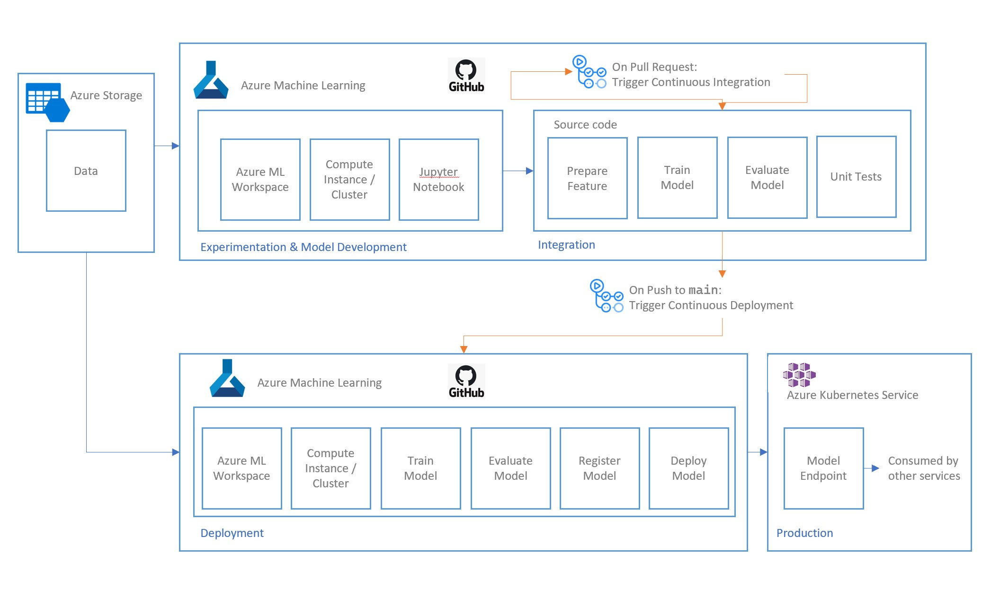

# Architecture

In this example, Azure Machine Learning (AML) is used in conjuction with github action to automate, customize, and execute the software development workflows.

AML is used for the purpose of The tasks of data analysis, data preparation, and modeling are carried out in Jupyter Notebooks within AML Workspace, using AML computes resources. While, Github Actions is used to manage the CI/CD workflow.

Figure above illustrates the architecture of this example solution, which highlight the application of Github Actions with Azure ML. 

In this example, there are 3 main phases:

- **Experimentation** : 
    - Data exploration and analysis, and model development cycle.
- **Integration** : 
    - Once feature preparation, regime of model training and methods of evaluation is determined, those source code can be integrated into the solution. 
    - When working on such software features in a Github branch, on the action of Github pull request to merge into main, this will trigger the Github Actions to take necessary steps, defined by the programmer, to ensure code quality and no error when new codes are integrated into the existing deployed solution. 
- **Deployment** :
    - Once integration tests is satisfied, on the action of Github push to merge into main, this will trigger the Github Action to take necessary steps, defined by the programmer, to ensure the deployment stage is successful, leading to a model endpoint in production, which other services can consume. 

Refer to [configuring-workflows.md](./configuring-workflows.md) on how the CI/CD workflow in this example is configured. 