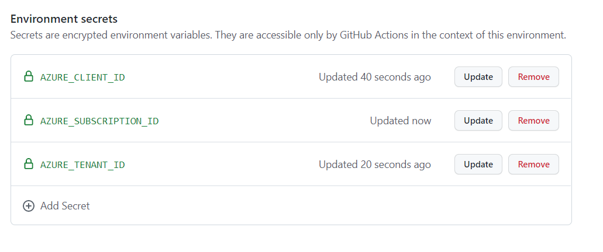
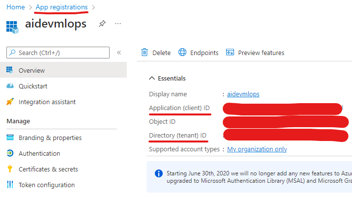
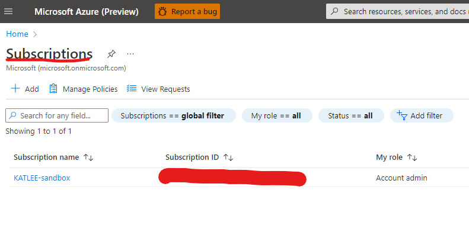

# How to create and configure GitHub Actions workflows

## environment-ci workflow

This workflow expects a secret containing azure credentials to be present in your repository.

To generate these credentials, follow these instructions to create a federated identity credential:
https://docs.microsoft.com/en-us/azure/active-directory/develop/workload-identity-federation-create-trust-github?tabs=azure-portal

Once you have created your application, make sure the application has contributor access to your subscription:
https://docs.microsoft.com/en-us/azure/role-based-access-control/role-assignments-portal?tabs=current#prerequisites

Navigate to your repository and create an environment called "dev" or whatever name you would like for your development environment.

Add three environment secrets:

Client Id and Tenant Id can be found in the properties of you application and subscription Id can be found by searching the portal for "Subscription." You will add the subscription Id of the subscription you added your application to as a contributor role.

