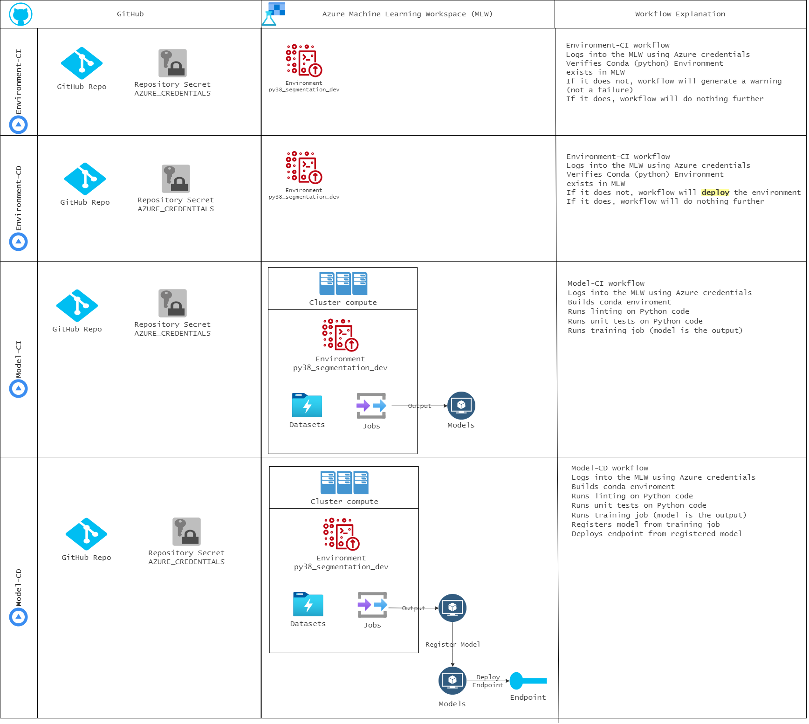

# How to create and configure GitHub Actions workflows

## Architecture

For high-level information about these workflows and the workloads they affect, please see this diagram:



## `environment-ci` Workflow

This workflow performs the following steps in one job:

1. Checks out code to the github-hosted runner
2. Installs the azure machine learning cli
3. Prepares Conda
4. Logs into the AML Worksapce using Azure credentials
5. Builds the Conda environment
6. Verifies Conda (python) Environment exists in AML Workspace
7. If it does not exist, workflow will generate a warning (not a failure)
8. If it does exist, workflow will do nothing further

This workflow expects a secret containing Azure credentials to be present in your repository.

To generate these credentials, follow these instructions to create the JSON output you will need to add to your repository secret.

Make sure you have the latest version of the azure cli: https://docs.microsoft.com/en-us/cli/azure/install-azure-cli

```bash
   az ad sp create-for-rbac --name "myApp" --role contributor \
    --scopes /subscriptions/{subscription-id}/resourceGroups/{resource-group} \
    --sdk-auth
```

  * Replace `{subscription-id}`, `{resource-group}` with your subscription and resource group details

  * The command should output a JSON object similar to this:

 ```json
  {
    "clientId": "<GUID>",
    "clientSecret": "<STRING>",
    "subscriptionId": "<GUID>",
    "tenantId": "<GUID>",
    "resourceManagerEndpointUrl": "<URL>"
    (...)
  }
  ```
  

Add a repository secret called `AZURE_CREDENTIALS` and paste the JSON output as the value of the secret.


This workflow is set to run on [workflow_dispatch](https://github.blog/changelog/2020-07-06-github-actions-manual-triggers-with-workflow_dispatch/), which is triggered by
- pull request on branch `main`
- changes on files under `.aml/environments/**`

If you would like to manually run the workflow, you may do so via the "workflow_dispatch" mechanism in your repo,
by going to the "Actions" tab, selecting the workflow, and clicking "Run workflow". This will only work after your workflow has run via automation at least once.

## `environment-cd` Workflow

This workflow performs the following steps in one job:

1. Checks out code to the github-hosted runner
2. Installs the azure machine learning cli
3. Prepares Conda
4. Logs into the AML Workspace using Azure credentials
5. Builds the Conda environment
6. Verifies Conda (python) Environment exists in AML Workspace
7. If it does not exist, workflow will deploy the environment.
8. If it does exist, workflow will do nothing further

This workflow expects a secret containing Azure credentials to be present in your repository.

To generate these credentials, follow these instructions to create the JSON output you will need to add to your repository secret.

Make sure you have the latest version of the Azure cli: https://docs.microsoft.com/en-us/cli/azure/install-azure-cli

```bash
   az ad sp create-for-rbac --name "myApp" --role contributor \
    --scopes /subscriptions/{subscription-id}/resourceGroups/{resource-group} \
    --sdk-auth
```

  * Replace `{subscription-id}`, `{resource-group}` with your subscription and resource group details.

  * The command should output a JSON object similar to this:

 ```json
  {
    "clientId": "<GUID>",
    "clientSecret": "<STRING>",
    "subscriptionId": "<GUID>",
    "tenantId": "<GUID>",
    "resourceManagerEndpointUrl": "<URL>"
    (...)
  }
  ```
  

Add a repository secret called AZURE_CREDENTIALS and paste the JSON output as the value of the secret.


This workflow is set to run on [workflow_dispatch](https://github.blog/changelog/2020-07-06-github-actions-manual-triggers-with-workflow_dispatch/), which is triggered by:

- push on branch `main`
- changes in files under `.aml/environments/**`

If you would like to manually run the workflow, you may do so via the workflow_dispatch mechanism by going to your repo,
going to the Actions tab, selecting the workflow, and clicking "Run workflow." This will only work after your workflow has run via automation at least once.

## `model-ci` workflow

This workflow performs the following steps in one job:

1. Checks out code to the github-hosted runner
2. Loads the environment from YAML 
3. Installs the azure machine learning cli
3. Prepares Conda
4. Logs into the MLW using Azure credentials
5. Builds the Conda environment
6. Runs python linting
7. Verifies Conda (python) Environment exists in MLW
7. If it does not exist, workflow will generate a warning (not a failure)
8. If it does exist, workflow will continue
9. Runs a training job in the MLW (output of this job is a model file)

Source code for the training routine is under: src/segmentation/train/train.py

This workflow expects a secret containing azure credentials to be present in your repository.

To generate these credentials, follow these instructions to create the JSON output you will need to add to your repository secret.

Make sure you have the latest version of the azure cli: https://docs.microsoft.com/en-us/cli/azure/install-azure-cli

```bash
   az ad sp create-for-rbac --name "myApp" --role contributor \
    --scopes /subscriptions/{subscription-id}/resourceGroups/{resource-group} \
    --sdk-auth
```

  * Replace {subscription-id}, {resource-group} with your subscription and resource group details

  * The command should output a JSON object similar to this:

 ```json
  {
    "clientId": "<GUID>",
    "clientSecret": "<STRING>",
    "subscriptionId": "<GUID>",
    "tenantId": "<GUID>",
    "resourceManagerEndpointUrl": "<URL>"
    (...)
  }
  ```
  
Add a repository secret called AZURE_CREDENTIALS and paste the JSON output as the value of the secret.


This workflow is set to run on [workflow_dispatch](https://github.blog/changelog/2020-07-06-github-actions-manual-triggers-with-workflow_dispatch/), triggered by:

- pull request on branch `main`
- changes in files under `.aml/jobs/**, src/**`


If you would like to manually run the workflow, you may do so via the "workflow_dispatch" mechanism in your repository, by going to the "Actions" tab, selecting the workflow, and clicking "Run workflow". This will only work after your workflow has run via automation at least once.